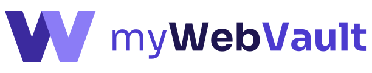

<p align="center">
  <picture>
    <source media="(prefers-color-scheme: dark)" srcset="docs/assets/mywebvault-banner-dark.svg" />
    
  </picture>
</p>

<h3 align="center">Your bookmarks, encrypted and synced everywhere.</h3>

<p align="center">
  <a href="LICENSE_GPL.txt"></a>
  
  
  
</p>

---

myWebVault is a bookmark manager for people who don't want their browsing life sitting in someone
else's database. Bookmarks are encrypted on your device before they're synced, so the server only
ever stores data it can't read. It's built on Bitwarden's open source, independently audited
encryption and sync, with the password manager parts switched off.

## Features

- **End-to-end encrypted.** Titles, URLs, folders, tags and notes are encrypted before they leave
  your browser.
- **Quick search.** Press <kbd>Ctrl</kbd>+<kbd>Shift</kbd>+<kbd>K</kbd>
  (<kbd>⌘</kbd>+<kbd>⇧</kbd>+<kbd>K</kbd> on Mac) on any page to search titles, URLs, folders,
  notes, or `#tags`.
- **Save in one click.** Save the current tab from the toolbar, or right-click any page or link and
  choose _Save to myWebVault_.
- **Folders, tags and notes.** Organise bookmarks your way and filter by folder or tag.
- **Import.** Bring in your existing browser bookmarks. Folders are kept and duplicates are skipped.
- **Synced everywhere.** Sign in on another browser and your bookmarks are there.

## Privacy by design

- **Zero-knowledge.** Your password never leaves your device. It derives the key that encrypts your
  vault, and the server stores only encrypted data.
- **Nothing reads your pages.** No host permissions and no always-on content scripts. Quick search is
  added to a page only when you press the shortcut, in a frame the page can't read.
- **No third-party lookups.** Website icons come from Chrome's local cache, not an icon service. There's
  no breach-check service and no marketing email.

### Permissions

| Permission                     | Why it's needed                                                                |
| ------------------------------ | ------------------------------------------------------------------------------ |
| `activeTab`, `scripting`       | Show quick search over the current tab, and save the current tab, when you ask |
| `contextMenus`                 | The _Save to myWebVault_ right-click items                                     |
| `favicon`                      | Website icons from Chrome's local cache                                        |
| `storage`, `unlimitedStorage`  | Keep your encrypted vault on your device                                       |
| `alarms`, `idle`               | Background sync and locking the vault when you're away                         |
| `offscreen`                    | Background tasks that need a page context in Manifest V3                       |
| `clipboardWrite`               | Inherited from Bitwarden                                                       |
| `bookmarks` _(optional)_       | Requested only when you import your browser bookmarks                          |
| `nativeMessaging` _(optional)_ | Inherited from Bitwarden's desktop app integration; never requested            |

## Download

Builds for Chrome, Edge, Firefox and Safari are attached to each
[release](https://github.com/jamesbruddick/mywebvault-clients/releases). Chrome and Edge are the
supported browsers for now; the Firefox and Safari builds are experimental and haven't been tested
in those browsers yet. Safari also needs the files wrapped in an app with Xcode before it can load
them.

## Getting started

You'll need Node.js 24.17 or later and npm 11.

```bash
git clone https://github.com/jamesbruddick/mywebvault-clients.git
cd mywebvault-clients
npm ci

cd apps/browser
npm run build:prod:chrome   # uses the hosted myWebVault server
# or
npm run build:chrome        # development build, uses http://localhost:8787
```

Then open `chrome://extensions`, turn on **Developer mode**, choose **Load unpacked**, and select
`apps/browser/build`. Use `npm run build:prod:edge` for Microsoft Edge.

The sync server is [mywebvault-api](https://github.com/jamesbruddick/mywebvault-api), a small
Bitwarden-compatible API that runs on Cloudflare Workers and D1.

## Project layout

Everything specific to myWebVault lives in
[`apps/browser/src/mywebvault`](apps/browser/src/mywebvault). Changes to Bitwarden's own files are
kept small, usually a switch check or a single import, so upstream security fixes stay easy to merge.
The folder's [README](apps/browser/src/mywebvault/README.md) lists every Bitwarden file that was
touched.

To pull in changes from Bitwarden (`bitwarden/clients` is the `upstream` remote):

```bash
git fetch upstream
git merge upstream/main
```

The Bitwarden Licensed code (`bitwarden_license/`) was removed from this fork. If a merge brings any
of it back, keep it deleted.

## License

myWebVault is licensed under the [GNU General Public License v3.0](LICENSE_GPL.txt). See
[LICENSE.txt](LICENSE.txt) for details.

Built on Bitwarden's open source code. Not affiliated with or endorsed by Bitwarden, Inc.
